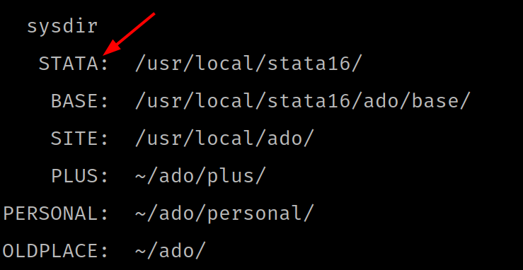

# Stata ado file for personal use

# Installation

1. 确定此 ado 文件的存放路径

    假设存放在当前文件夹下的 `<parentpath>/adopersonal` 目录, 那么可以采用如下命令，保存

    ```bash
    cd "<parentpath>"
    git clone https//github.com/liubianshi/ado.git adoperonal
    ```

    当然也可以直接从 [liubianshi/ado](https//github.com/liubianshi/ado) 下载压
    缩包，然后解压到指定目录

2. 确定 Stata 目录的位置

    打开 stata 软件，输入 `sysdir`, STATA 对应的位置就是 Stata 系统目录对应的位置

    

3. 编辑该目录下的文件 `profile.do`, 在开头加入如下代码，`<parentpath>` 用第一
   步的存放目录替代。

    ```stata
    adopath + "<parentpath>"
    ```

4. 打开 stata 应用，在命令行输入 `test_hello_world`, 如果返回 "Hello World"，
   说明安装成功，否则，前面的路径设置可能有问题。


# 命令介绍

## `snappreserve`/`snaprestore`

语法：

```stata
snappreserve [name] [, label]
snaprestore [name]
```

作用：

很多时候，数据处理需要临时对数据做破坏性操作，
此时，`preserve` 是最常见的选择，也是好用的选择。
然而，`preserve` 不允许嵌套，有些时候，此功能的缺失让人遗憾。
另外，`preserve` 还有一个不知道缺点，可能仅对我个人如此，
经常在数据的交互操作时，错误地（很多时候是不小心）`restore` 数据。
Stata 提供了 `snapshot` 作为补充。
`snapshop` 的功能很强大，缺点是 `snapshot restore`, 即快照恢复并不方便。
它依赖保存 snapshot 时系统生成的序号，
具体该需要是什么，在 do 文件中是很难预测的，
也不应该去做这种预测。
同时， Stata 本身并没有提供一种保存该序号的命令。
虽然这并非不可以解决，也不是非常麻烦，但写的次数多了，总还是麻烦。
如果能够用名称保存 Snapshot，并用相应的名称恢复 Snapshot 就再好不过了。
这就是 `snappreserve` 和 `snaprestore` 的出发点。

例如：

```stata
di "Outer: `=_N'"
snappreserve befor_test, label("keep snapshot before test")
    quietly sysuse auto, clear
    di "Inner: `=_N'"
    snappreserve
        clear
        di "Inner's Inner: `=_N'"
        preserve
            quietly sysuse auto, clear
            quietly keep in 1/10
            di "Inner's Inner's Inner: `=_N'"
        restore
        di "Inner's Inner: `=_N'"
    snaprestore
    di "Inner: `=_N'"
snaprestore befor_test
di "Outer: `=_N'"
```


